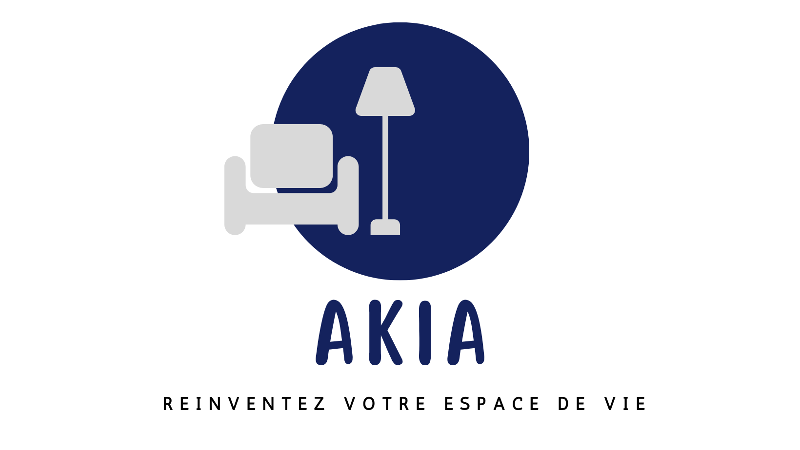

#  Akia - Réinventez Votre Espace de Vie  
 <p align="center">
  
</p>

Bienvenue sur Akia, l'expérience ultime d'achat de meubles prêt à monter . Nous ne vendons pas seulement des meubles, nous offrons la possibilité de créer un espace qui reflète votre style unique. Avec Akia, le 
montage devient une expérience sans effort grâce à notre service professionnel d'assemblage.

## Akia Video Demo 

## Captures d'écran Explicatives :


## Fonctionnalités principales:

- **Catalogue Étendu :** Parcourez notre vaste catalogue de meubles pour trouver le style qui correspond à vos goûts.
  
- **Commande en Ligne :** Faites vos achats en toute simplicité grâce à notre interface de commande conviviale.

- **Assemblage Facile :** Nos meubles sont conçus pour un assemblage facile, accompagnés de guides détaillés.

- **Livraison Rapide :** Profitez d'une livraison rapide à votre porte pour une expérience de magasinage sans tracas.

## Comment Commencer?

1. **Cloner le Répertoire :** Utilisez la commande suivante pour cloner le projet sur votre machine locale.
   ```bash
   git clone https://github.com/votre_utilisateur/akia-ecommerce.git
   
2. **Installation des Dépendances :**  Exécutez les commandes suivantes pour installer les dépendances nécessaires.
   ```bash
   cd akia-ecommerce
   npm install

   
3. **Configurer l'Environnement :** Créez un fichier .env à la racine du projet et configurez les variables d'environnement nécessaires.  

4. **Démarrer l'Application :** Lancez l'application en utilisant la commande suivante.
   ```bash
    npm start
  ## Réalisé par :
  |   NOM & Prénom        |
  |--------------------|
  |   LEGSIR Imane       | 
  |   LAOUAJ Kaoutar     | 
  |   DOBLI Hajar        |
  |   ZAOUI Nousseiba    |
  
